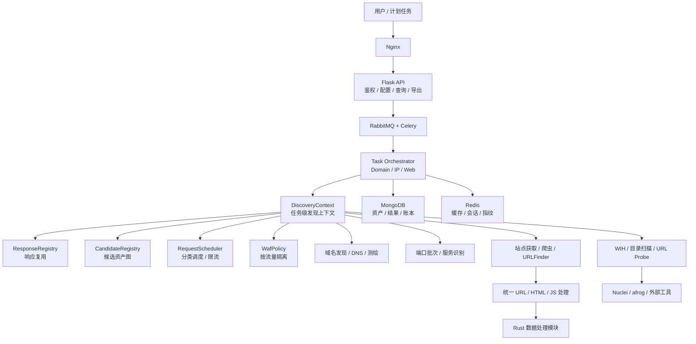

<!-- 这是一张图片，ocr 内容为： -->


基于 ARL 的互联网资产自动化收集平台二开版本。
本版本围绕资产发现、Web 情报、任务调度、结果治理和平台运维进行了深度重构，保留原有 API 与 Mongo 结果结构，便于平滑升级。

> 站在外部的角度，如果不知道自己拥有什么，就无法保护什么。
>
> 平台用于合法授权范围内的互联网资产梳理、安全验证和持续监测，覆盖域名、IP、站点、URL、端口、服务、指纹和 Web 情报等资产类型。

---

## 快速开始

### 前置条件

- Docker
- Docker Compose
- 可用内存建议 >= 4GB
- 可用磁盘建议 >= 8GB

```plain
# 新版UI及调整优化 newUI分支
git clone -b newUI https://github.com/wpsec/ARL-Source-Install.git
cd ARL-Source-Install
cp .env.example .env
# 请修改密码～
chmod +x build.sh start.sh scripts/quick-build.sh
./build.sh
./start.sh
```

### 注意！

可提前开代理下载Playwright 以提升部署速度

参考文档：

```plain
tools/playwright/README.md
```

支持 amd64 与 arm64 部署，已在 macOS Apple Silicon ARM64 Docker 环境完成构建和核心回归；部署到 x86 服务器时使用 amd64 镜像或对应架构的 buildx/runner 验收。

### 密码修改

忘记系统账户密码时，使用重置脚本按提示设置新密码；仓库文档不记录明文密码。

```plain
./resetpass.sh
```

### 访问方式

- 访问地址：`http://<服务器IP>`
- Basic Auth：
  - 用户名：`.env` 中 `BASIC_AUTH_USERNAME`（默认 `admin`）
  - 密码：必须在 `.env` 中设置 `BASIC_AUTH_PASSWORD`，系统不再提供默认密码
- ARL 应用默认账号：
  - 用户名：`.env` 中 `ARL_APP_USERNAME`（默认 `admin`）
  - 密码：建议在 `.env` 中显式设置 `ARL_APP_PASSWORD`，生产环境不要依赖 Compose 默认值
  - 说明：仅在 Mongo 数据卷首次初始化时生效。若已存在 `arl_db`，需清理数据卷后重新初始化。
- 支持1-2个 Worker
  - 在 .env 中镜像配置

### 更新

```bash
# 日常更新
git pull
./scripts/quick-build.sh
```

### Worker 横向扩展说明（v4.3.0）

扫描容器服务名统一为 `worker_1`、`worker_2`，支持部署时选择 1 个或 2 个 worker：

```plain
# .env
ARL_WORKER_REPLICAS=1   # 可选: 1 或 2，默认 1
```

## 深度重构成果

- **代码结构**：`commonTask.py` 由约 2744 行收敛至约 1002 行；任务编排、阶段执行、配置、结果写回和生命周期拆为独立服务。
- **统一发现链路**：站点爬虫、URLFinder、WIH、目录扫描共享响应、候选、来源和 WAF 状态，减少重复请求与结果丢失。
- **数据处理优化**：使用 Rust 深度优化 URL、HTML、JS 信息提取、归一化、过滤、去重、排序和指纹计算。
- **扫描调度**：域名解析、测绘 provider、端口扫描采用分批、限流、超时、重试和熔断策略；`all` 端口保持完整扫描语义。
- **指纹治理**：重新梳理指纹文件、规则映射、缓存和产品识别，支持本地扩展与结果去重。
- **UI 重构**：新版 React UI，统一主题、页面骨架、卡片、表格、弹窗和任务状态展示；Plan 04 继续推进 daisyUI 与模块拆分。
- **多架构支持**：兼容 amd64 与 arm64，已完成 macOS Apple Silicon ARM64 Docker 构建和核心回归。
- **AI 能力**：旧 AI 渗透链路已清理；Strix 已完成集成方向和安全兼容性预研，暂不作为默认生产扫描链路。

## 二开功能总览

### 资产发现与扫描

- 域名爆破、DNS 解析、证书关联、测绘引擎、搜索引擎和 Host 碰撞
- IP、端口、服务、OS、SSL、站点、URL、目录和指纹识别
- CDN/WAF 识别、边缘 IP 跳过、异常开放端口识别
- Nuclei、afrog、文件泄漏和 WIH 信息收集

### Web 情报与结果治理

- 统一提取页面链接、表单、脚本、API、目录和新子域
- 支持 `Swagger / OpenAPI / Postman` 文档解析
- URL、目录、JS 候选统一归一化、去重、排序和来源聚合
- 保留 `source` 兼容字段，并聚合 `sources` 完整展示来源
- WAF 按流量类型隔离，目录扫描受限不影响正常爬虫和 WIH

### 平台化增强

- 渐进式扫描：发现结果先展示，深度阶段完成后任务才标记完成
- 任务阶段、批次、provider、队列、失败、降级和重试可观测
- 计划任务、任务同步、批量操作、同名任务聚合和历史对比
- Excel、HTML、AI Markdown 异步报告导出与轮询下载
- 配置中心、热刷新、API/provider 测试、提示词管理和敏感字段保护
- Celery/RabbitMQ 重任务队列隔离、Worker 横向扩展和任务恢复
- 钉钉机器人通知、知识库结构化写入、系统监控和运行日志聚合

## 重构后架构



<!-- 这是一张图片，ocr 内容为： -->


<!-- 这是一张图片，ocr 内容为： -->


<!-- 这是一张图片，ocr 内容为： -->


<!-- 这是一张图片，ocr 内容为： -->


<!-- 这是一张图片，ocr 内容为： -->


<!-- 这是一张图片，ocr 内容为： -->


<!-- 这是一张图片，ocr 内容为： -->


<!-- 这是一张图片，ocr 内容为： -->


<!-- 这是一张图片，ocr 内容为： -->


<!-- 这是一张图片，ocr 内容为： -->


<!-- 这是一张图片，ocr 内容为： -->


<!-- 这是一张图片，ocr 内容为： -->


<!-- 这是一张图片，ocr 内容为： -->


<!-- 这是一张图片，ocr 内容为： -->


### 基础设施版本升级

<!-- 这是一张图片，ocr 内容为： -->


| 组件         | 当前版本                          | 说明                                          |
| ------------ | --------------------------------- | --------------------------------------------- |
| 基础系统镜像 | `rockylinux:8`                    | ARL 主应用镜像基座（`ARL/docker/Dockerfile`） |
| MongoDB      | `mongo:7.0`                       | 资产数据存储                                  |
| RabbitMQ     | `rabbitmq:3.13-management-alpine` | Celery 消息队列                               |
| Redis        | `redis:7-alpine`                  | 业务缓存与性能优化                            |
| nginx        | `nginx:1.24-alpine`               | basic 和服务暴露                              |
| node         | `node:20.20.1-bookworm`           | 编译前端                                      |
| golang       | `go1.22.4`                        | 构建阶段编译 `wih`（优先离线包，构建后清理）  |
| Python       | `Python-3.10.20`                  | 后端（离线安装包）                            |
其它 bug 修复：补齐任务恢复、WAF 隔离、结果幂等、来源聚合和异常降级。

---

## Bug？

添加公众号联系我，如果使用的人多，在考虑修复

## 更新日志

更多补丁级（PATCH）更新明细、版本号与日期，请以 [CHANGELOG.md](./CHANGELOG.md) 为准。

## 免责声明

本项目仅用于合法授权的资产梳理、安全验证与研究场景。请勿用于未授权目标。

<!-- 这是一张图片，ocr 内容为： -->


