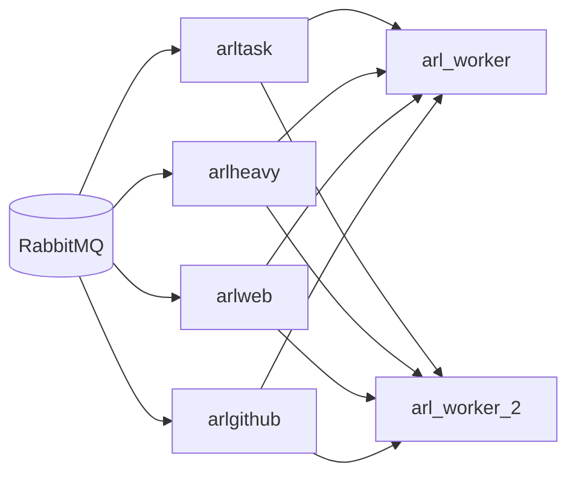

# ARL 新增一个 `arl_worker` 的横向扩展计划

## 1. 目标与边界

### 1.1 目标

1. 在现有架构基础上，通过新增 1 个 `arl_worker` 容器分担任务执行压力。
2. 提升队列消费能力，缩短任务排队与阶段完成时间。
3. 不拆分 `redis/rabbitmq/mongodb`，保持核心基础设施稳定。

### 1.2 边界

1. 本计划不改 `arl_nginx/arl_redis/arl_rabbitmq/arl_mongodb` 职责。
2. 只做 worker 横向扩展，优先保证可回滚。
3. 先以“可运行稳定”为第一目标，再做细粒度性能压榨。

---

## 2. 当前现状（扩展前）

当前 `arl_worker` 单容器同时拉起 4 组 Celery worker：`arltask / arlheavy / arlweb / arlgithub`。  
默认并发（来自配置）：

- `CELERY_TASK_WORKER_CONCURRENCY = 3`
- `CELERY_HEAVY_WORKER_CONCURRENCY = 3`
- `CELERY_WEB_WORKER_CONCURRENCY = 3`
- `CELERY_GITHUB_WORKER_CONCURRENCY = 2`

总并发槽位约 `11`（队列并发求和）。

---

## 3. 扩展后目标拓扑

说明：先采用“同队列多消费者”的标准横向扩展模式，不改变路由逻辑。

---

## 4. 实施方案（推荐分两步）

## 4.1 Step A：零代码快速扩展（优先）

### 做法

1. 在 `docker-compose.yml` 新增 `worker_2` 服务，复用与 `worker` 相同镜像、挂载、依赖。
2. `worker_2` 使用同一 `start_worker.sh` 启动脚本。
3. 为 `worker` 与 `worker_2` 分别设置环境变量，控制并发，避免总并发翻倍过猛。

### 并发建议（首版）

- `worker`：
  - `ARL_CELERY_TASK_WORKER_CONCURRENCY=2`
  - `ARL_CELERY_HEAVY_WORKER_CONCURRENCY=2`
  - `ARL_CELERY_WEB_WORKER_CONCURRENCY=2`
  - `ARL_CELERY_GITHUB_WORKER_CONCURRENCY=1`
- `worker_2`：
  - `ARL_CELERY_TASK_WORKER_CONCURRENCY=2`
  - `ARL_CELERY_HEAVY_WORKER_CONCURRENCY=2`
  - `ARL_CELERY_WEB_WORKER_CONCURRENCY=2`
  - `ARL_CELERY_GITHUB_WORKER_CONCURRENCY=1`

结果：总并发从 11 提升到约 14（更平滑），先追求稳定，再按指标逐步提升。

### 优势

1. 上线快，改动小，可在当天灰度。
2. 不改业务代码，失败可快速回滚。
3. 所有队列吞吐都有提升。

### 劣势

1. 仍是“4 队列同容器”，隔离度有限。
2. 两个容器都会消费所有队列，资源利用不够精细。

---

## 4.2 Step B：小改造精细分担（可选）

### 做法

1. 在 `start_worker.sh` 增加队列启停开关（如 `ARL_ENABLE_QUEUE_ARLWEB=true/false`）。
2. `worker` 侧重 `arltask + arlgithub`，`worker_2` 侧重 `arlweb + arlheavy`。
3. 通过开关让不同容器消费不同队列，实现“同容器数下更高隔离”。

### 优势

1. 不增加容器数量，但显著提升隔离度。
2. Web 重任务与常规任务互相影响更小。

### 劣势

1. 需要改启动脚本并验证守护逻辑。
2. 运维参数复杂度略有增加。

---

## 5. 上线步骤

1. 基线采样（上线前 24 小时）  
记录队列积压、任务平均排队时长、任务完成时长、CPU/内存峰值。

2. 新增 `worker_2` 服务并设置较保守并发  
先按 Step A 并发建议启动，避免瞬时压垮 DB/MQ。

3. 灰度观察 2~4 小时  
重点观察 `arlweb` 与 `arlheavy` 队列 backlog 是否下降。

4. 调参  
若稳定，优先把 `ARL_CELERY_WEB_WORKER_CONCURRENCY` 从 2 提到 3，再观察。

5. 固化配置  
将通过验证的并发参数写回运行配置与文档。

---

## 6. 验收指标（建议）

1. `messages_ready`（`arlweb/arlheavy`）峰值下降 >= 30%
2. 主任务排队时长（`dispatch_time -> start_time`）下降 >= 25%
3. 任务完成后 AI 去噪落库延迟下降 >= 30%
4. 无新增大面积 `worker` 异常退出或 RabbitMQ 通道异常

---

## 7. 风险与规避

1. 风险：总并发增大导致 Mongo/RabbitMQ 压力升高  
规避：先用保守并发，分批提升；观察连接数与慢查询。

2. 风险：日志量与磁盘写入增大  
规避：按容器拆分日志文件并限制滚动大小。

3. 风险：某队列仍成为瓶颈  
规避：优先提升对应队列并发，不盲目整体加并发。

---

## 8. 回滚方案

1. 停止并移除 `worker_2`：
   - `docker compose stop worker_2`
   - `docker compose rm -f worker_2`
2. 恢复 `worker` 原始并发配置。
3. 验证队列消费恢复正常后结束回滚。

---

## 9. 推荐执行结论

1. 立即执行 Step A（零代码，风险最低）。
2. 稳定后按指标判断是否进入 Step B（小改造，收益更高）。
3. 整体策略是“先扩容分担，再细化隔离”。

