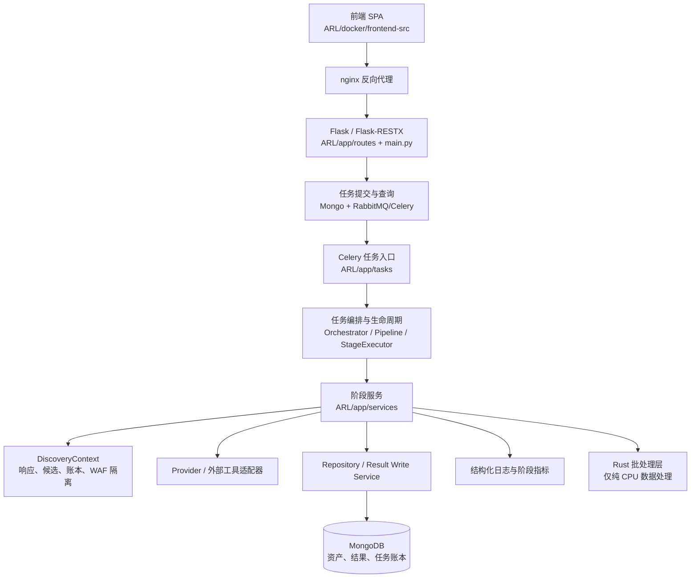

# ARL-TI 开发指南

> 面向后续开发者。本文以当前仓库的实际目录、运行链路和已冻结接口为准，目标是让新需求可定位、可验证、可回滚。计划文档中的状态标签仍是实施进度的唯一依据；本文不把“已设计”表述成“已完成”。

## 1. 先记住四条边界

1. 先找现有入口和职责，再写代码；禁止因为“看起来更干净”就移动目录或重做一套架构。
2. HTTP API、Mongo 结果字段、任务状态、公共函数签名默认都是兼容契约。需要变化时，先更新计划、冻结契约并补迁移/兼容测试。
3. 新逻辑放入现有层级的合适扩展点。没有明确的调用关系、测试和收益证明，不新增 `manager`、`common`、`framework` 等泛化中间层。
4. 失败、降级、待处理和跳过必须可观测；不得把异常转换成空结果，不得静默 fallback。

当前定型的是边界和协作方式，不代表所有计划批次都已完成。开发前先查看 `docs/README.md` 和 `docs/plan/` 中的文件名状态。

## 2. 系统整体架构

### 2.1 请求到结果的主链路



运行期组件的职责如下：

| 层 | 主要位置 | 责任 | 不应承担的责任 |
|---|---|---|---|
| 接入层 | `ARL/app/main.py`、`ARL/app/routes/` | 鉴权、参数校验、HTTP 响应、路由注册 | 扫描编排、直接拼接复杂扫描流程 |
| 任务入口 | `ARL/app/celerytask.py`、`ARL/app/tasks/` | Celery 任务注册、恢复入口、任务类型分流 | 复制造轮子式的业务阶段实现 |
| 编排与生命周期 | `task_orchestrator.py`、`web_site_fetch_orchestrator.py`、`task_pipeline.py`、`stage_executor.py`、`task_finalizer.py` | 阶段顺序、状态、预算、异常、收尾、恢复 | 具体 provider 规则、解析细节、Mongo 查询细节 |
| 业务阶段 | `ARL/app/services/*_stage_services.py` 及对应服务 | 一个阶段或一组紧密相关能力 | 变成全局万能服务 |
| 共享发现上下文 | `discovery_context.py`、`discovery_queue.py`、`discovery_ledger_store.py` | 任务内响应复用、候选资产图、来源、状态、WAF 流量隔离、幂等检查 | 直接发 HTTP、直接写 Mongo、替代任务事实源 |
| 持久化 | `ARL/app/repositories/`、`task_result_write_service.py`、`task_result_item_service.py` | 查询、结果写入、幂等写入、旧字段兼容 | 私自改 Mongo 文档结构 |
| 数据模型 | `ARL/app/modules/` | `DomainInfo`、`IPInfo`、`PageInfo`、`WihRecord`、枚举和状态 | 处理网络 IO 或业务编排 |
| 基础工具 | `ARL/app/utils/`、`ARL/app/helpers/` | 通用 HTTP、URL、DNS、日志、连接和小型辅助函数 | 放置只被一个 stage 使用的业务流程 |
| 外部能力 | `ARL/app/services/*Client.py`、`nuclei_scan.py`、`afrog_scan.py`、`tools/` | provider、nmap、WIH、Nuclei、afrog 等外部程序适配 | 把外部工具源码随意改成项目业务层 |
| Rust 加速 | `ARL/native/arl_accel/`、`ARL/app/services/rust_accel.py` | 批量 URL/HTML/JS 解析、过滤、去重、排序、指纹等纯计算 | Mongo、Redis、Celery、HTTP、DNS、浏览器、AI 或外部程序 |

### 2.2 任务与网站扫描链路

域名/IP任务由 `ARL/app/tasks/` 进入对应 Orchestrator。域名任务通常先做发现，再进入深度阶段；IP任务先做网络扫描，再根据开放服务进入后续处理。所有正式阶段都应通过 `StageExecutor` 执行，以统一记录状态、预算、耗时、结果数和失败原因。

网站处理遵循“共享数据、独立策略”：

```text
初始响应
  → DiscoveryContext.ResponseRegistry
  → 爬虫消费 HTML 并发现候选
  → URLFinder 消费页面/JS 内容并生成候选
  → WIH 消费响应、JS、API 候选并探测
  → 目录扫描按独立 profile 领取未覆盖候选
  → 站点识别、结果写入和后置风险扫描
```

同一任务内，同一请求 profile 的成功响应优先复用；`normal`、`crawler`、`wih`、`directory`、`browser` 等流量类别必须保持独立并发、超时和熔断语义。目录扫描触发的 WAF 信号不能直接熔断爬虫和 WIH；只有确认主机级封禁才暂停站点全部请求。

### 2.3 核心状态和幂等

候选状态使用：

```text
discovered → queued → fetching → fetched → covered
                         ├→ failed
                         ├→ degraded
                         ├→ pending
                         └→ skipped
```

任务终态仍需兼容现有消费方：`done`、`done_pending`、`done_degraded`、`error`、`stop`。不能把“首批结果已展示”当作深度扫描完成。

阶段幂等键固定为：

```text
task_id + stage + target + scan_profile + input_signature
```

代码中的序列化表示为以 `|` 分隔的稳定字符串。新增队列、重试或结果写入逻辑必须复用这套语义。

## 3. 仓库目录地图

| 路径 | 用途 | 放置规则 |
|---|---|---|
| `ARL/app/routes/` | API namespace 和 HTTP 接口 | 只做接入、校验、调用服务；新接口先确认 API 契约 |
| `ARL/app/tasks/` | Celery 任务入口 | 只做任务类型分流和生命周期入口，阶段逻辑放 service |
| `ARL/app/services/` | 领域服务、阶段服务、编排、适配器 | 优先复用已有服务；新增文件必须能说明所属边界 |
| `ARL/app/repositories/` | Mongo 查询和写入 | 结果结构变化必须补兼容和迁移说明 |
| `ARL/app/modules/` | 领域模型、枚举、状态常量 | 影响公共字段时先冻结契约 |
| `ARL/app/utils/` | 跨领域、无业务归属的通用工具 | 不能借 `utils` 名义隐藏业务流程 |
| `ARL/app/dicts/` | 字典、指纹、规则、模板 | 按数据维护规则生成和校验 |
| `ARL/native/arl_accel/` | Rust crate 和 Python 扩展 | 只接受批量纯计算输入，不放 IO |
| `ARL/test/` | 后端 unittest、fixture、golden corpus | 新业务测试放这里；按模块建立最小测试集 |
| `ARL/docker/` | Dockerfile、Compose、运行期挂载模板 | 只改构建/运行配置；敏感运行文件不入 Git |
| `ARL/docker/frontend-src/` | 前端源码、构建配置 | 页面逻辑遵守现有组件和路由约定 |
| `scripts/` | 冻结、生成、构建、校验脚本 | 生成产物路径变化必须同步所有引用 |
| `tools/` | 外部工具、第三方数据和工具源码 | 默认只读；不要把第三方工具重写成业务模块 |
| `docs/` | 计划、review、历史、参考文档 | 按目录和文件名状态标签维护 |
| 根目录 `app/`、`test/` | 当前为空的占位目录 | 不在此新增运行代码或测试；实际代码分别在 `ARL/app`、`ARL/test` |

## 4. 新需求的标准开发流程

### 第一步：分类和定位

先判断需求属于 API、前端、任务入口、扫描 stage、共享发现、provider、数据文件、性能、构建还是文档。然后查找已有入口、调用方和测试，不凭文件名猜职责。

推荐从仓库根目录执行：

```bash
rg -n "目标类名|目标函数|现有阶段名" ARL/app ARL/test
codegraph query "目标类名或函数名"
```

优先确认三件事：谁创建对象、谁调用它、结果在哪里写回。若已有服务满足边界，直接扩展该服务，不新增平行实现。

### 第二步：冻结契约

以下任一项变化，都必须先补文档或测试契约：

- HTTP 路由、请求参数、响应字段、认证方式；
- Mongo 文档字段、结果类型、来源字段、任务状态；
- `WihRecord`、`IPInfo`、`DomainInfo` 等公共模型；
- 指纹/规则 JSON schema；
- stage 名称、幂等键、失败和降级状态；
- Rust adapter 的批量输入输出。

契约未明确前，不进行跨目录迁移、不重命名公共接口、不删除旧兼容路径。

### 第三步：在原边界内实现

按以下顺序选择扩展点：

1. 已有 service 的新方法或策略分支；
2. 已有 stage service 的新 stage；
3. 已有 repository/result writer 的查询或写入扩展；
4. 已有 adapter 的能力补充；
5. 只有在前四项无法表达且有设计评审结论时，才新增文件或目录。

新阶段必须接入 `TaskPipeline.run_stage` 或直接使用任务的 `StageExecutor`，不能从任务入口绕过生命周期执行器。新网络能力必须经过任务级上下文和对应流量类别；新结果必须经过统一写入服务并保留来源和幂等规则。

### 第四步：补可观测性和异常语义

至少记录：`task_id`、stage、target/batch、输入数、输出数、耗时、成功数、失败数、超时数、待处理数、降级原因。provider、Rust、外部工具和队列异常必须有明确状态。

代码要求：

- 当前批次异常只影响当前批次；
- fallback 必须记录阶段、批次、异常类型和次数；
- provider 失败不能伪装成“无结果”；
- 不记录 API key、Token、密码、Cookie 或带凭据 URL；
- 禁止空 `except`、空 `catch` 和只吞异常不留日志的分支。

### 第五步：测试、Review 和交付

先跑最小针对性测试，再跑相关回归；随后检查 diff 边界、生成产物、运行配置和文档。业务代码改动必须附带测试或说明为什么无法测试；文档、生成文件和依赖变更也要说明影响。

只有用户明确要求时才创建本地 commit；禁止自动 push。提交信息遵循：

```text
<type>(<scope>): 中文简短说明
```

## 5. 允许修改与禁止修改范围

### 5.1 允许修改

| 范围 | 条件 |
|---|---|
| `ARL/app/services/` | 在现有领域边界内增加 stage、策略、adapter 或结果服务，并补调用链测试 |
| `ARL/app/routes/` | 新增或扩展 API，先冻结契约并保持旧接口兼容 |
| `ARL/app/tasks/` | 增加任务入口分流、恢复或编排调用；不把业务实现堆回任务文件 |
| `ARL/app/repositories/` | 增加查询/幂等写入，保留旧字段和索引语义 |
| `ARL/app/modules/` | 增加确有必要的模型/枚举；同步更新所有消费方和测试 |
| `ARL/app/dicts/` | 通过脚本和 schema 维护，附来源、版本、hash 或 golden 变化 |
| `ARL/native/arl_accel/` | 纯 CPU、批量、可回退的解析/归一化/去重/排序/指纹逻辑 |
| `ARL/test/`、`scripts/`、`docs/` | 与本需求直接相关，并能复现和验证结果 |
| `ARL/docker/` | 构建链、依赖、架构和非敏感默认模板调整 |

### 5.2 禁止擅自修改

- 禁止把新的业务流程继续堆进 `commonTask.py`；它只能保留兼容入口和确有必要的公共能力。
- 禁止直接改 HTTP API、Mongo 字段、导出字段、任务状态含义而不做契约和兼容验证。
- 禁止把 Mongo、Redis、Celery、HTTP、DNS、Playwright、LLM 或外部工具调用放进 Rust。
- 禁止把 Redis 当作任务结果唯一事实源；任务账本和关键结果必须有持久化语义。
- 禁止修改 `config-runtime.yaml`、`.env` 或把其中的值复制进代码、日志、文档和 commit。
- 禁止直接编辑 gzip 生成产物冒充源数据；禁止手工改生成结果后跳过校验脚本。
- 禁止把 `tools/wih` Go 实现擅自改写为 Rust；Rust 只做已证明有收益的纯数据热点。
- 禁止为了“统一风格”批量重命名旧文件、移动现有目录、删除兼容字段或拆出无调用方的新层。
- 禁止把第三方工具、模板和数据文件改成项目私有业务代码；需要升级必须记录版本和影响。
- 禁止以提高并发为默认优化方案；先用阶段指标证明瓶颈，再做受控调整。

## 6. 数据文件与 JSON 配置规则

### 6.1 通用规则

- 所有 JSON 使用 UTF-8、合法 JSON，不写注释，不混入 trailing comma。
- 字段名、枚举和值类型保持稳定；变更必须更新消费者、schema、golden 和迁移说明。
- 源文件保持确定性输出：稳定排序、固定缩进、固定换行；同一输入重复生成结果应一致。
- 生产运行配置只从模板和安全存储注入；不要把密钥、Token、Cookie、密码、真实连接串或个人数据写入仓库。
- 纯文本字典一行一个候选，去除意外空白和重复项；先用小字典跑通，再扩大规模。

### 6.2 指纹和规则文件

当前需要区分“源数据、规范产物、兼容文件、运行期文件”：

| 文件 | 定位 | 维护方式 |
|---|---|---|
| `ARL/app/dicts/site_fingerprints.json.gz` | 站点指纹规范产物 | 由生成脚本产生，做 schema、golden、hash 和运行时加载测试 |
| `ARL/app/dicts/service_fingerprints.json.gz` | 端口/协议/服务指纹规范产物 | 同上；区分 TCP/UDP、证据、置信度和解析来源 |
| `ARL/app/dicts/webapp.json` | 旧 Web 应用指纹兼容数据 | 只在兼容路径仍需要时维护，不与新产物手工混写 |
| `ARL/app/dicts/kscan_fingerprint*.json` | Kscan 兼容输入/本地增量 | 使用现有审计和生成流程；明确 local 增量，不直接伪装成主产物 |
| `tools/finger.json` | 工具侧指纹源/种子 | 作为输入源维护，生成规范产物，不手改压缩结果 |
| `ARL/app/dicts/wih_rules.yml` | WIH 规则配置 | 保持规则 schema、版本和回归样本；变更需验证误报/漏报影响 |
| `config-runtime.yaml` | 用户运行配置 | 只在本地/部署环境存在，禁止提交、回显和复制敏感值 |

当前 `SITE_FINGERPRINT_SOURCE` 等开关决定运行期采用的来源。不要因为规范产物已经生成，就未经验证切换默认来源；切换必须有真实加载、匹配、回退和结果一致性测试。

新增或调整指纹时必须说明：来源、版本、生成脚本、输入 hash、匹配字段、证据要求、置信度、冲突优先级和回退策略。以“命中数量增加”作为唯一目标会放大误报，必须同时观察有效命中、误报样本和未识别样本。

### 6.3 生成物和目录卫生

以下内容不得进入 Git：

- `ARL/native/arl_accel/target/`；
- wheel、缓存、临时构建目录、`.pyc`、`.pytest_cache`；
- 运行期日志、导出文件、截图和上传内容；
- `.env`、`config-runtime.yaml` 及任何包含真实凭据的文件。

若生成脚本改变输出路径，必须同时更新脚本、文档、测试和引用；不要通过复制一份同名文件来绕过路径约束。

## 7. 命名、目录放置和接口约定

### 7.1 命名

- 新 Python 文件使用 `snake_case.py`；新类使用 `PascalCase`；函数、变量和配置键使用 `snake_case`/大写下划线。
- 新阶段服务使用 `XxxStageService`；任务编排使用 `XxxOrchestrator`；持久化使用 `XxxRepository` 或现有 Result Write Service 语义。
- 前端新组件使用 `PascalCase.tsx`/`PascalCase.jsx`；函数和变量使用 `camelCase`，遵循现有 TypeScript 配置。
- 旧文件中已有的 `fetchSite.py`、`commonTask.py` 等命名暂不批量改名；新代码不要继续扩大旧命名风格。
- 测试使用 `ARL/test/test_*.py`，fixture 放在对应测试目录或已有 `fixtures/`、`data/` 下。

### 7.2 Python 接口

- 现有公共函数签名默认不变；需要新参数时优先增加可选参数并保持旧调用有效。
- 成功路径返回稳定类型，不能通过 `None` 隐式表达失败；失败使用现有状态/异常语义并记录原因。
- 结果写入使用 `WihRecord(record_type, content, source, site, fnv_hash)` 等现有模型；`source/sources` 必须保留完整来源集合。
- stage 通过 `TaskPipeline`/`StageExecutor` 执行，不直接手写一套状态、计时和异常处理。
- `DiscoveryContext` 是任务内协作上下文，不是跨任务永久结果库；需要持久化时走账本或 repository。

### 7.3 Rust adapter 接口

- 输入必须是批量页面文本、JS、候选集合、站点范围和扫描选项；禁止逐条 FFI 调用。
- 输出必须是 Python 可消费的稳定集合，并携带当前批次 metrics；不得使用全局计数器推导并发任务指标。
- Rust 只做确定性、无副作用、可测试的 CPU 计算；网络和业务状态留在 Python。
- 导入失败、批次异常、结果校验失败时，只回退当前批次 Python；fallback 必须可观察。
- Rust 结果不得减少 Python 的有效结果；golden corpus 是放大范围前的门禁。

### 7.4 前端接口

- 页面请求通过现有 API client、query/cache 和路由体系；不要在组件内重复实现鉴权、任务轮询和全局失效逻辑。
- 列表 key 必须稳定；弹窗、表格和错误边界保持可访问性与错误可恢复性。
- 修改 API 字段前同步后端契约、类型定义、空值处理和构建门禁。

## 8. 提交前检查和测试门禁

### 8.1 所有改动

```bash
git diff --check
git status --short
```

确认 diff 只包含本需求文件；确认没有 `target/`、wheel、缓存、日志、运行期配置、Token 或密码。不要用“文件被 Git 忽略”替代人工确认敏感文件未被复制到其他位置。

### 8.2 Python 后端

在 `ARL/` 目录执行：

```bash
python3 -m unittest discover -s test -p 'test_*.py'
```

按改动范围至少补跑：

- `test_stage_executor.py`、`test_task_pipeline.py`、`test_task_finalizer.py`；
- `test_task_orchestrator.py`、`test_web_site_fetch_orchestrator.py`；
- `test_discovery_context.py`、`test_discovery_ledger_store.py`、`test_discovery_strategy_wiring.py`；
- `test_task_result_*`、来源聚合、WAF、队列和恢复相关测试；
- 指纹 registry、golden、构建脚本和运行时加载测试；
- Rust adapter、Python fallback 和 `test_compare_rust_python_corpus.py`。

若环境缺少可选依赖，必须记录跳过原因和实际执行集合，不能写成“全量通过”。

### 8.3 生成数据和 Rust

从仓库根目录执行冻结/对照脚本前，先确认工作区允许更新对应生成文件：

```bash
python3 scripts/api-unified-golden.py --check
python3 scripts/freeze-api-contract.py
python3 scripts/fingerprint-baseline.py
python3 scripts/fingerprint-local-audit.py
```

Rust crate 使用锁文件和 release 方式验证：

```bash
cd ARL/native/arl_accel
cargo test --locked
python3 smoke_test.py
```

`target/` 只能是本地构建目录，不得提交。若使用 maturin 构建 wheel，构建产物只用于镜像或本地验证，提交前清理并确认 Git 未跟踪。

### 8.4 前端和容器

在 `ARL/docker/frontend-src/` 执行：

```bash
npm ci
npm run lint
npm run build
```

在 `ARL/docker/` 执行配置校验和与当前目标架构一致的 smoke test：

```bash
docker compose config
```

生产镜像必须验证：web、worker、scheduler 使用同一应用镜像；Rust 模块可导入；运行期配置来自安全挂载；amd64 与 arm64 使用同一套 Python、Rust、前端和任务链 smoke test。缺少安全运行配置时只报告缺项，不把真实凭据写入文档或命令历史。

### 8.5 性能门禁

性能优化必须同时记录阶段墙钟、CPU、网络等待、输入/输出数、缓存命中、重复请求、fallback 和失败/待处理数量。不能只报“总耗时”，也不能用单次任务冒充 p95。

- 40 目标用于定位重复请求、WAF 隔离和阶段瓶颈；
- 64 目标用于正式 p95 门禁；
- Rust 需达到热点 CPU 降低 30% 或吞吐达到 Python 的 1.5 倍；
- 接入 Rust 后端到端阶段耗时不得恶化超过 5%；
- 结果数量和有效集合不能减少；
- 所有目标最终必须是完成、明确失败、降级或待处理之一。

## 9. 常见错误示例

| 错误 | 后果 | 正确做法 |
|---|---|---|
| 在 `CommonTask` 中新增方法但未检查子类/初始化链 | `WebSiteFetch` 缺少 `_get_stage_executor`、`_is_obvious_wih_secret_noise` 等方法，运行到深层 stage 才崩溃 | 修改公共基类后先查全部子类、构造函数和真实任务链，并补回归测试 |
| service 返回了新字段但模型构造函数未同步 | `IPInfo.__init__()` 收到未知 `_suspected_all_open` 参数而失败 | 公共模型变更先统一字段契约，兼容旧输入并补构造测试 |
| stage 直接调用函数，绕过 `StageExecutor` | 页面显示无阶段耗时、异常被吞、任务状态提前完成 | 使用 `TaskPipeline.run_stage`，由执行器统一负责生命周期 |
| provider 超时直接返回空列表 | 用户误以为“没有资产”，实际是 provider 失败 | 返回 `failed/degraded/pending` 证据，继续执行其它 provider |
| URLFinder、爬虫、WIH各自重新请求同一页面 | 请求放大、WAF 连坐、结果互相不可见 | 首次响应登记 `ResponseRegistry`，其它策略消费缓存 |
| 只按 URL 去重，不保留来源 | 结果数量看似正确，但无法追溯和判断可信度 | 使用候选资产图合并候选，完整合并 `sources/source_details` |
| 爬虫发现新域名却只回写当前工具 | 目录扫描和 WIH 漏掉新资产 | 发布统一发现事件，进入 DNS/WAF、站点、WIH、目录队列 |
| 手工编辑 gzip 指纹文件或只改生成结果 | 下次生成被覆盖，无法审计和复现 | 修改源数据/生成脚本，执行固定校验并记录 hash |
| Rust 直接请求网络或写 Mongo | 破坏职责边界，难以回退、测试和跨架构发布 | Python 管理 IO/状态，Rust 只接收批量数据并返回结果和 metrics |
| 只在 Mac ARM 构建成功就宣布生产可用 | x86 glibc、raw socket、Playwright 或镜像层可能不兼容 | 最后用 amd64/arm64 相同 smoke test 和目标架构镜像验收 |
| 用提高全局并发掩盖慢阶段 | WAF、Mongo、RabbitMQ 和目标站点被压垮，失败更多 | 先看阶段指标，再按 traffic class、host、provider 受控调度 |

## 10. 红线约束

- 只扫描得到授权的目标和范围；不得为了调试把真实凭据或未授权目标写进 fixture、日志或文档。
- 不得提交或输出秘密配置、API key、密码、Token、Cookie、授权请求头和带凭据 URL。
- 不得静默失败、静默降级、以空结果掩盖超时，或在未完成深度队列时提前写干净 `done`。
- 不得让 Rust 访问外部服务，不得把 Rust 变成第二套业务系统。
- 不得把 Redis 作为唯一结果事实源，不得绕过账本、幂等键和统一结果写入。
- 不得擅自重构、批量改名、移动目录、新增无关层级、重写 `tools/wih` 或打乱现有任务链。
- 不得用删除测试、放宽断言、修改 golden 结果的方式制造“通过”；每个结果变化都要有原因和证据。
- 不得执行破坏性 Git 操作或自动 push；未经明确要求不创建 commit。

## 11. 新开发者第一天清单

```text
[ ] 阅读 docs/README.md，确认当前计划和 review 状态
[ ] 从 ARL/app/routes、ARL/app/tasks、ARL/app/services 找到需求入口
[ ] 使用 rg/codegraph 查调用方、结果写回点和现有测试
[ ] 确认需求是否影响 HTTP/Mongo/任务状态/数据 schema
[ ] 选择已有层级，不新增平行目录和万能中间层
[ ] 为 stage、队列、provider、Rust 或数据变更补 metrics 和失败语义
[ ] 先跑针对性测试，再跑相关回归和构建 smoke
[ ] 检查来源聚合、幂等、重复请求和旧数据兼容
[ ] 检查 diff、敏感信息、生成物和运行期配置
[ ] 更新对应计划/review/CHANGELOG，并等待评审后再提交
```

## 12. 变更记录模板

每个跨边界变更至少在 PR/commit 或对应计划中记录：

```text
需求：
影响层：route / task / orchestrator / stage / repository / data / rust / ui / docker
现有入口：
保持不变的契约：
新增或变更的指标：
失败、降级和回退：
幂等键与重复执行处理：
测试命令与结果：
生成物、镜像和架构影响：
敏感信息检查：
```

无法填写“现有入口、保持不变的契约、测试命令”中的任一项时，先停在设计阶段，不直接改结构。
