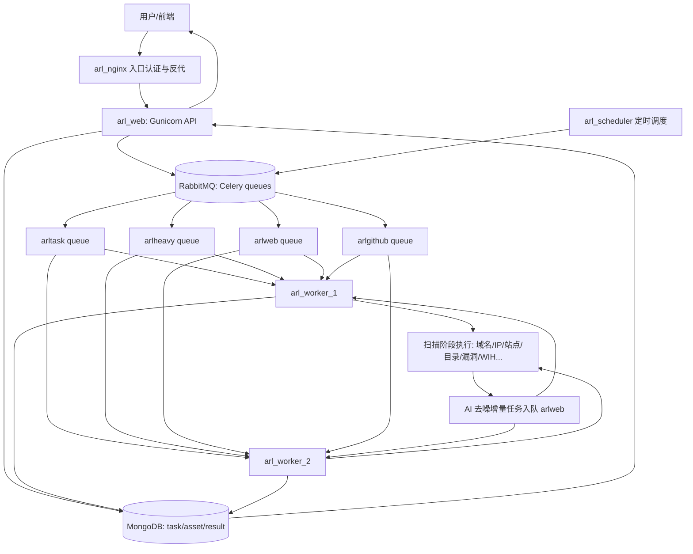
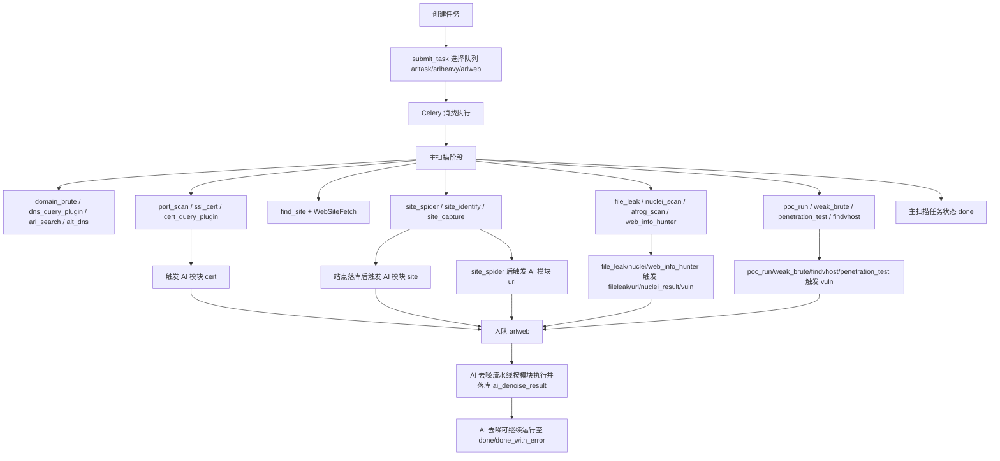
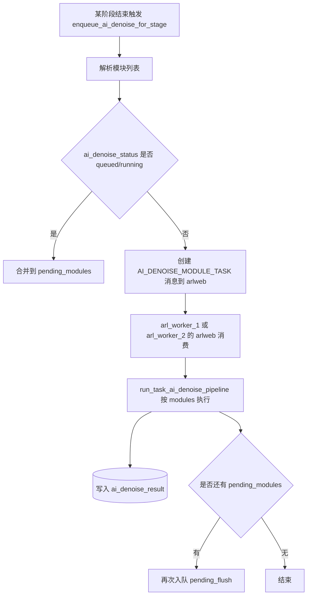

# ARL 容器职责与任务流程分析

## 1. 结论先看

- AI 去噪执行容器：`arl_worker_1 / arl_worker_2`（取决于哪一个先消费到 `arlweb` 队列消息）
- AI 去噪执行队列：`arlweb`（由 `arl_task_web` 消费）
- `arl_web` 容器不跑 Celery worker，只负责 Web/API（Gunicorn）与容器内 Nginx
- 部署默认 `ARL_WORKER_REPLICAS=2`，即同时启用 `worker_1 + worker_2`；也可切换为 `1`
- 当前架构下，worker 容器承担 `arltask/arlheavy/arlweb/arlgithub` 四类队列，容器总体负载通常高于 `arl_web`

---

## 2. 容器职责拆分

| 容器 | 主要职责 | 关键进程 |
|---|---|---|
| `arl_nginx` | 外部入口、基础认证、反向代理到 `arl_web` | `nginx` |
| `arl_web` | Web 前端资源 + API 服务 | `nginx`（容器内） + `gunicorn app.main:arl_app` |
| `arl_worker_1` | 异步任务执行（扫描/爬虫/漏洞/AI去噪/GitHub等）主实例 | 4 组 `celery worker` |
| `arl_worker_2` | 异步任务执行（横向扩展分担）副实例 | 4 组 `celery worker` |
| `arl_scheduler` | 定时调度器（监控任务、周期任务下发） | `python3 -m app.scheduler` |
| `arl_rabbitmq` | Celery Broker 队列 | RabbitMQ |
| `arl_redis` | 缓存/辅助状态 | Redis |
| `arl_mongodb` | 任务与资产数据存储 | MongoDB |

---

## 3. Worker 容器当前承载内容（重点）

每个 worker 容器启动脚本都会同时拉起 4 个 worker（同一容器内）：

- `-Q arlgithub`
- `-Q arlheavy`
- `-Q arlweb`
- `-Q arltask`

对应并发来自配置：

- `CELERY_GITHUB_WORKER_CONCURRENCY`
- `CELERY_HEAVY_WORKER_CONCURRENCY`
- `CELERY_WEB_WORKER_CONCURRENCY`
- `CELERY_TASK_WORKER_CONCURRENCY`

当前默认是双实例（`worker_1 + worker_2`）共同消费同一组队列。  
另外，为降低恢复抖动：

- `worker_1` 默认 `ARL_WORKER_RECOVER_ON_BOOT=1`（执行启动恢复）
- `worker_2` 默认 `ARL_WORKER_RECOVER_ON_BOOT=0`（跳过启动恢复，仅消费新消息）

### 3.1 队列与任务类型

| 队列 | 典型任务 | 说明 |
|---|---|---|
| `arltask` | 常规域名/IP任务、风险巡航、FOFA、资产任务（默认） | 默认主队列 |
| `arlheavy` | 重扫描任务（如端口量/目标量/服务识别条件触发） | 扫描重活隔离 |
| `arlweb` | Web 重阶段任务（截图/爬虫/目录/nuclei/afrog/WIH/渗透测试）+ AI 去噪任务 | 当前 AI 去噪都在此队列 |
| `arlgithub` | GitHub 搜索与监控任务 | 与资产扫描隔离 |

### 3.2 AI 去噪为什么在 worker 容器

- AI 去噪任务由 Celery action `AI_DENOISE_TASK` / `AI_DENOISE_MODULE_TASK` 执行
- 入队入口统一走 `arl_task_web.delay(...)`，即进入 `arlweb` 队列
- `arlweb` 队列消费者在 `arl_worker_1 / arl_worker_2` 容器中

所以 AI 去噪一定在 worker 容器，不是在 `arl_web`

---

## 4. `arl_web` 当前承载内容

`arl_web` 主要承担：

- API 接口：任务管理、资产查询、AI 管理、导出报告等
- 前端静态资源分发
- 与 MongoDB/Redis/RabbitMQ 的读写交互（通过 API 触发任务和查询状态）

`arl_web` 不直接执行扫描/去噪计算型任务，不消费 Celery 队列。

---

## 5. 全链路流程（整体任务）

---

## 6. 单任务流程（以 Domain/IP 任务为例）

> 说明：阶段名会因开关不同而变化，下图是主干。
>  
> 说明：单条 Celery 消息会被一个 worker 进程消费并执行主流程，不会被两个 worker 同时执行同一条消息。

---

## 7. 单个 AI 去噪任务流程（模块级）

---

## 8. 负载分析（当前架构）

### 8.1 为什么 worker 容器容易高负载

- 所有异步执行都在 worker 容器内完成（每个实例都包含 4 队列消费者）
- `arlweb` 队列既承载 Web 重阶段，又承载 AI 去噪
- AI 去噪改为“阶段增量触发”后，任务响应更快，但 `arlweb` 消息密度更高
- 若切换为单实例（`ARL_WORKER_REPLICAS=1`），所有压力都会集中到 `worker_1`

### 8.2 `arl_web` 的负载特征

- 主要是 API QPS、查询聚合、导出接口、前端静态资源
- 不承担扫描和 AI 去噪计算，因此 CPU 峰值通常低于 worker 容器

### 8.3 可操作优化建议

- 优先确认副本数：默认 `ARL_WORKER_REPLICAS=2`，低配机器可临时降为 `1`
- 优先调 `CELERY_WEB_WORKER_CONCURRENCY`，因为 AI 去噪在 `arlweb`
- 若端口重扫多，调 `CELERY_HEAVY_WORKER_CONCURRENCY`
- 若普通任务积压，调 `CELERY_TASK_WORKER_CONCURRENCY`
- 必要时拆分部署：将 `arlweb` 队列单独到专门 worker 容器

---

